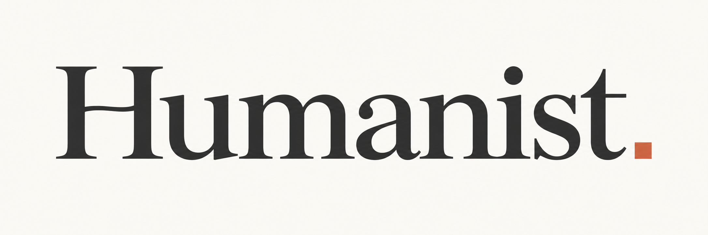
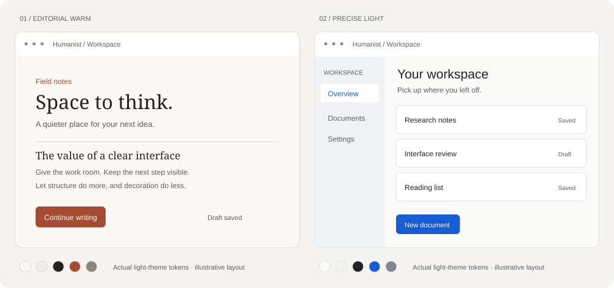

<p align="center"></p>
<p align="center"></p>
<p align="center"><strong>界面设计札记</strong></p>
<p align="center">从 Anthropic 与 Kimi 的公开设计实践中，提炼可迁移的前端设计方法。</p>
<p align="center">
  <a href="DESIGN_SPEC.md">阅读规范</a> ·
  <a href="research/READING_GUIDE.md">了解来源</a> ·
  <a href="docs/INSTALL.md">使用与安装</a> ·
  <a href="https://github.com/Hai-qq/humanist-frontend/releases/latest">下载 Skill</a>
</p>
<p align="center">
  <a href="https://github.com/Hai-qq/humanist-frontend/actions/workflows/validate.yml"></a>
  <a href="LICENSE"></a>
  <a href="https://github.com/Hai-qq/humanist-frontend/releases"></a>
</p>

---

Humanist 是一项围绕 **Anthropic 与 Kimi 的设计指南、产品案例、团队访谈及公开实现资料**开展的整理与提炼工作。它关注这些设计选择解决了什么问题、为何成立，以及如何迁移到自己的阅读界面、研究工具和软件工作台。

项目将材料整理成有依据、有适用范围的设计规范，再浓缩为编码 Agent 能按任务调用的 Skill。**来源事实、作者的综合判断和原创实现默认分别标明。** 这些材料并非两家公司共同发布的统一系统，本项目也不宣称官方隶属关系。

## 从资料到实现

| 层次 | 回答的问题 | 产物 |
|---|---|---|
| 阅读与研究 | 材料说了什么？读到了哪里？ | [来源导读](research/READING_GUIDE.md)与[完整台账](research/SOURCE_AUDIT.md) |
| 设计判断 | 为什么采用、调整或放弃某种做法？ | [证据与决策](research/EVIDENCE_AND_DECISIONS.md) |
| 实施规范 | 如何应用，何时调整，怎样检验？ | [完整设计规范](DESIGN_SPEC.md) |
| Agent 执行 | 当前任务该选择哪些规则？ | [Skill 入口](skills/humanist-frontend/SKILL.md) |

研究台账共有 50 条记录，包含基础技术资料、节选及共同来源，不能据此宣称读完了 50 份独立的完整材料。来源快照为 2026-09-08；本版重组既有研究，未重新核验全部外部来源。

## 提炼出的设计关注点

- **温暖而清晰**：通过字体职责、阅读节奏与反馈形成体验，颜色承担其中的一部分。
- **表达服从场景**：阅读页、展示页与工作台分配不同的视觉密度和品牌表达。
- **保留人的主导权**：辅助内容可编辑，执行范围可理解，失败后能继续，控制与实际能力一致。
- **从真实内容出发**：用长中文、文件名、数据和操作状态检验设计，再精修视觉。

以上是本项目的跨材料综合。具体来源、迁移理由与限制见各章，不把案例观察转写成已验证的效果承诺。

## 看这些判断如何落到页面


这组静态示例围绕“整理一篇研究笔记”，展示信息层级、工作区结构和恢复路径；不是 Anthropic/Kimi 产品截图，也不是已实现应用的测试结果。[示例说明](docs/EXAMPLES.md)

<details>
<summary>可选配色：温暖阅读型与清晰轻盈型</summary>



`editorial-warm` 与 `precise-light` 均提供明暗 token，是原创实施起点，不与两家公司一一对应。已有项目优先沿用设计系统，其他风格也可以应用本规范。[Token 使用](docs/TOKENS.md)

</details>

## 选择你的使用方式

### 直接阅读

从[设计规范](DESIGN_SPEC.md)开始，了解原则、理由、适用条件和检查方法；无需安装任何工具。

### 引入项目约定

挑选相关规则，与现有设计系统对齐。整体设计可参考[项目模板](skills/humanist-frontend/templates/DESIGN.template.md)，只记录本项目采用的规则与调整理由。无需复制全部研究材料。

### 安装 Agent Skill

需要 Python 3.10+，在已有项目中选择一种宿主：

```bash
git clone https://github.com/Hai-qq/humanist-frontend.git
cd humanist-frontend

# 任选一个；将路径换成你的已有项目目录
python3 scripts/install_skill.py --host codex --project /path/to/project
python3 scripts/install_skill.py --host claude --project /path/to/project
python3 scripts/install_skill.py --host kimi --project /path/to/project
```

安装器只复制文件，不覆盖已有 Skill。安装后检查宿主是否加载。[安装与升级说明](docs/INSTALL.md)

```text
使用 humanist-frontend，为当前研究笔记项目改进阅读与保存体验。
沿用现有主题，先确定内容层级与状态问题，再实现相关改动。
检查中文长文本、保存失败与恢复，说明哪些行为尚未验证。
```

展示名称为 **Humanist · 界面设计札记**；仓库地址、目录和调用名保留 `humanist-frontend`，已有使用方式不变。

## 文档与维护

[开发与检查](docs/DEVELOPMENT.md) · [评估协议](evals/README.md) · [更新记录](CHANGELOG.md) · [视觉标识](docs/BRAND.md)

当前包检查覆盖生成物同步、引用、安装和归档；包含 47 项测试、88 个声明的纯色色对。[本版验证记录](reports/VALIDATION.md)

18 个 Agent 场景仍待执行，包检查不代表页面视觉、宿主实机加载或整页 WCAG 验收。欢迎通过[问题反馈](https://github.com/Hai-qq/humanist-frontend/issues/new)提供真实项目中的失败案例；[贡献约定](CONTRIBUTING.md)说明如何补充依据与规则。

参与讨论请遵守[社区约定](CODE_OF_CONDUCT.md)；安全问题使用[私密报告流程](SECURITY.md)。

---

原创部分采用 [MIT License](LICENSE)。第三方名称、资料与素材范围见 [THIRD_PARTY_NOTICES](THIRD_PARTY_NOTICES.md)。
