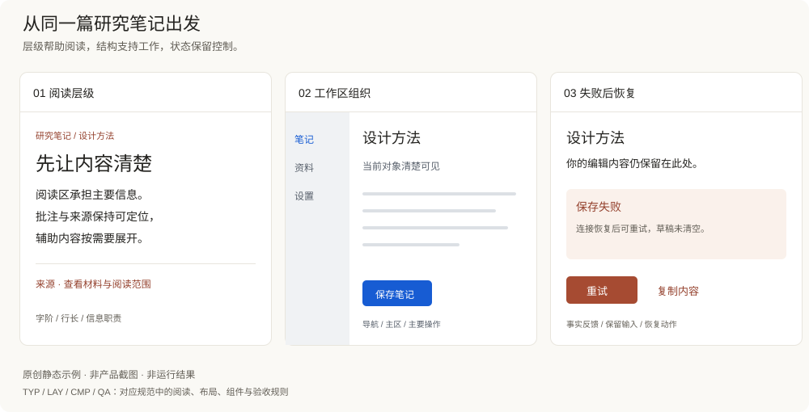

# 原则如何进入页面

同一个任务：整理一篇研究笔记。三个侧面分别展示设计判断，不是顺序操作录像；具体布局为本项目原创示例。

| 侧面 | 设计理由 | 相关规则 | 要检查什么 |
|---|---|---|---|
| 阅读 | 标题、正文和来源各有职责，减少不必要的视觉竞争 | TYP-01–02 / LAY-01 / DAT-01 | 真实长文、中文换行和来源定位 |
| 组织 | 导航与编辑区分层，当前对象明确，辅助面板按需出现 | CTX-01 / LAY-01 / RUN-04 | 窄窗口与对象切换，保留编辑内容 |
| 恢复 | 保存失败保留草稿，提供明确重试与复制操作 | CMP-02 / CMP-04 / QA-01 | 失败、重复提交、迟到响应 |

阅读例使用温暖主题，工作区例使用轻盈主题，以说明可选实现。这不是把某个主题指定给某家公司；同一原则也适用于既有品牌和深色模式。图中的保存状态为说明文字，未连接后端。

配色示例见 [Token 使用](TOKENS.md)，完整判断见[设计规范](../DESIGN_SPEC.md)。
